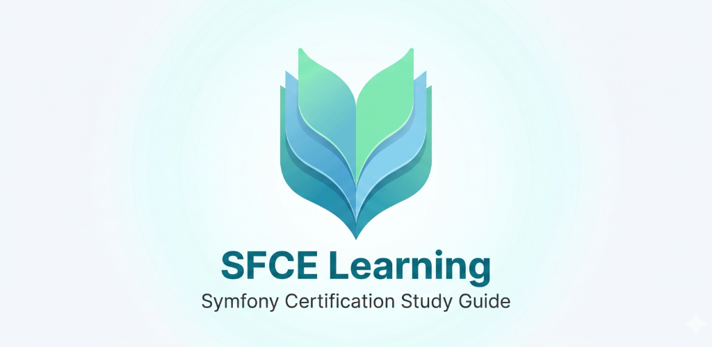

# Symfony Certification Study Guide

<p align="center">
  <a href="https://github.com/kardasz/sfce/actions/workflows/pages.yml">
    
  </a>
  <a href="https://sfcelearning.com">
    
  </a>
</p>

<p align="center">
  <a href="https://sfcelearning.com">
    
  </a>
</p>

<p align="center">
  A free, open-source study guide for the
  <a href="https://certification.symfony.com/">Symfony Framework Certification Exam</a>,
  built with Astro and Tailwind CSS.
</p>

<p align="center">
  <strong>🌐 Web · <a href="https://sfcelearning.com">sfcelearning.com</a></strong>
</p>

## Now on the App Store and Google Play — native app for iPhone, iPad, Mac & Android

Prefer to study offline? **SFCE Learning** is also available as a native app on
Apple platforms and Android. Same content as
[sfcelearning.com](https://sfcelearning.com) — fast, offline-ready, and at home
on each platform. Progress syncs through iCloud on Apple devices and is backed
up via Auto Backup on Android, and you can plug your study plan straight into
Calendar and Reminders.

<p align="center">
  <a href="https://apps.apple.com/app/sfce-learning/id6764245530">
    
  </a>
  &nbsp;
  <a href="https://apps.apple.com/app/sfce-learning/id6764245530?mt=12">
    
  </a>
  &nbsp;
  <a href="https://play.google.com/store/apps/details?id=com.sfcelearning">
    
  </a>
</p>

<p align="center">
  Learn more on the <a href="https://sfcelearning.com/app/">app landing page</a>.
  Requires iOS / iPadOS / macOS 26.4 or later.
</p>

### What you get in the app

- 📚 The full Symfony 6.0, 7.0 and 8.0 outlines, browseable offline
- ✅ Per-reference progress tracking with iCloud sync across Apple devices
- 🧠 Built-in quizzes to test yourself on each topic
- 📅 Calendar and Reminders integration to plan your prep
- 🌗 Native light and dark mode, optimised for iPhone, iPad, Mac and Android

## Supported Versions

- [Symfony 8.0](docs/8.0.md) (default)
- [Symfony 7.0](docs/7.0.md)
- [Symfony 6.0](docs/6.0.md)

## Getting Started

```bash
npm install    # install dependencies
npm run dev    # start dev server
npm run build  # production build
```

## Privacy Policy

See [PRIVACY.md](PRIVACY.md).

## License

This project is licensed under the [CC BY-NC 4.0](https://creativecommons.org/licenses/by-nc/4.0/) license. See [LICENSE](LICENSE) for details.
